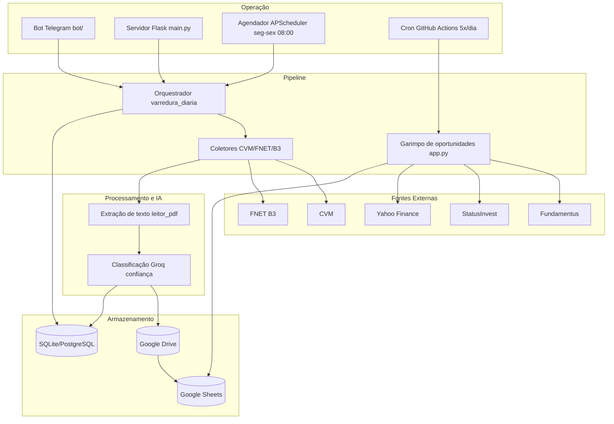

# 🤖 Robô Financeiro & Data Lake Institucional

 

Bem-vindo ao repositório do **Robô Financeiro**, um ecossistema de Engenharia de Dados focado no mercado financeiro brasileiro (B3).

 

Este sistema abandona o modelo amador de planilhas manuais e implementa uma arquitetura automatizada de **coleta, auditoria e armazenamento** de FIIs e Ações: raspagem de documentos oficiais (FNET/CVM/B3), classificação com Inteligência Artificial, cofre documental no Google Drive, dashboard em Google Sheets e operação em tempo real via **bot do Telegram**.

 

---

 

## 🎯 Objetivos Alcançados (Arquitetura Atual)

 

- **Data Lake Dinâmico:** Utilização do Google Sheets como banco de dados visual (Dashboard), recebendo cargas contínuas e automatizadas via APIs (`batch_update` em abas `BD_FIIs`, `BD_Acoes`, `BD_Logs`).

- **Scraping Resiliente:** Sistema de fallback duplo. Se uma fonte falha (ex.: Fundamentus fora do ar), o robô busca os dados no **Yahoo Finance** (yfinance) ou **StatusInvest** — inclusive com retry automático em cada requisição.

- **Acervo Documental na Nuvem:** Varredura autônoma no sistema **FNET da B3** e na **CVM** para capturar Fatos Relevantes, Relatórios Gerenciais, formulários e informes, organizando-os automaticamente em pastas dinâmicas no Google Drive (`Documentos → Tipo → Ticker → Ano → Mês`).

- **Inteligência Artificial Documental:** Todo PDF baixado passa por **extração de texto** (PyPDF2/PyMuPDF/pdfplumber) e **classificação pela API Groq (LLM)**, que devolve um JSON com tipo de documento e nível de **confiança** — documentos com confiança ≥ 80 são salvos automaticamente; os demais seguem para **revisão humana**.

- **Bot de Telegram Operacional:** Interface mobile em tempo real para controle do fluxo, emissão de alertas de oportunidades (quando um ativo entra na margem de desconto) e links diretos para leitura de PDFs oficiais.

- **Banco de Dados Relacional:** Integração com **SQLite (padrão) ou PostgreSQL (produção)** via SQLAlchemy para evitar processamentos duplicados, registrando o histórico de relatórios baixados com máquina de estados (`SALVO_DRIVE`, `AGUARDANDO_REVISAO`, `ERRO_DOWNLOAD`, `ERRO_DRIVE`, `REJEITADO_MANUAL`).

 

---

 

## 🏗️ Arquitetura Geral

 



 

---

 

## 📂 Mapeamento de Arquivos e Módulos

 

### 📱 Interface e Servidor

- `main.py`: O **"cérebro" da comunicação** e o verdadeiro ponto de entrada web. Roda 24/7 no Render (via Webhook/Gunicorn), sobe o Flask, registra o webhook do Telegram, cria as tabelas do banco e agenda a varredura diária com o APScheduler.

- `bot/loader.py`: Cria a **instância única** do bot (telebot).

- `bot/comandos.py`, `bot/handlers.py`, `bot/callbacks_menus.py`, `bot/callbacks_revisao.py`: Menus, comandos, navegação por setor/tipo e o fluxo de **revisão humana** de documentos.

- `app.py`: **Garimpo de oportunidades** — não é o servidor web. Roda no cron do GitHub Actions, dispara os scrapers de FIIs/Ações, grava em lote nas planilhas e envia alertas consolidados.

 

### 🕵️ Motores de Busca e Auditoria (Scrapers)

- `modules/scraper_fiis.py`: Motor focado em Fundos Imobiliários. Audita P/VP, Dividend Yield, **vacância física real**, quantidade de imóveis e inquilinos via StatusInvest (JSON + HTML), com preço do Fundamentus e fallback no Yahoo Finance.

- `modules/scraper_acoes.py`: Caçador de barganhas focado em Ações. Calcula P/L, P/VP, ROE, Margens e Dividend Yield (Fundamentus + fallback Yahoo Finance) e organiza o portfólio por setores.

- `fnet_scraper.py`: Robô especializado na plataforma da **B3 (FNET)**, encarregado de caçar e baixar PDFs institucionais.

- `pipeline_dados/coletor_cvm.py`: Leitura institucional dos documentos da **CVM** (relatórios e formulários por ano/ativo).

- `pipeline_dados/coletor_docs_acoes.py` e `pipeline_dados/coletor_fiis.py`: Coletores específicos de ações e informes de FIIs.

 

### 📁 Gerenciamento de Nuvem, IA e Banco de Dados

- `atualizador_documentos.py`: A ponte entre a B3, o Banco de Dados, a IA e o Google Drive. Verifica se o documento já está registrado, baixa PDFs inéditos, **extrai o texto, classifica com Groq e salva** no Drive quando a confiança é alta.

- `modules/GoogleDriveManager.py`: Módulo customizado de API do Google. Verifica a existência de diretórios, cria pastas hierárquicas dinâmicas (`Documentos → Tipo → Ticker → Ano → Mês`, além da pasta de revisão `⚠️ REVISÃO`) e faz o upload dos PDFs liberando link público.

- `modules/leitor_pdf.py`: Extração de texto de PDFs (PyMuPDF + pdfplumber).

- `modules/module_ia.py`: Consultas interativas de fatos relevantes dos ativos via LLM (Groq/OpenAI).

- `pipeline_dados/banco_dados.py`: Modelagem ORM (SQLAlchemy) com as classes e constraints do sistema (`Ativos`, `DadosFinanceirosAcoes`, `DadosFinanceirosFiis`, `DocumentosQualitativos`).

- `services/orquestrador.py`: **Ponto de entrada do pipeline** — a `varredura_diaria` que roda a rotina B3/FNET, a coleta CVM e dispara os alertas.

- `services/planilhas.py` e `services/dashboard_menus.py`: Leitura de Sheets com cache (TTL 5 min) e geração dos painéis de oportunidades/favoritos exibidos no bot.

- `services/logo_service.py`: Fornece os links de logos dos ativos nos menus.

 

### 🛠️ Configurações e Variáveis de Ambiente

- `config.py`: Centralizador de variáveis de ambiente, catálogos (mapas de tickers, setores, CNPJs e contas CVM), filtros de garimpo e tipos de documento.

- `requirements.txt`: Relação estruturada das dependências do Python para build e deployment.

- `.github/workflows/main.yml`: Cron de execução do garimpo no GitHub Actions (segunda a sexta, 13h–21h UTC).

 

---

 

## 🚀 Progresso do Sistema

 

### ✅ Implementado e em produção

 

| Módulo | Status |

|---|---|

| Bot do Telegram (webhook, comandos, menus, revisão) | ✅ Ativo |

| Servidor Flask + webhook no Render | ✅ Ativo |

| Agendador diário (APScheduler, seg-sex 08:00 America/Sao_Paulo) | ✅ Ativo |

| Varredura diária orquestrada | ✅ Ativo |

| **IA Documental (Groq)** — extração de PDF + classificação JSON + confiança ≥ 80 | ✅ Ativo em `atualizador_documentos.py` |

| Coleta **CVM** (ações e relatórios) | ✅ Ativo |

| Coleta **FNET/B3** (informes e relatórios) | ✅ Ativo |

| Upload automático ao Google Drive (pastas hierárquicas + revisão) | ✅ Ativo |

| Planilhas Google Sheets (BD_FIIs, BD_Acoes, BD_Logs) | ✅ Ativo |

| Garimpo de oportunidades (Ações + FIIs) via GitHub Actions | ✅ Ativo |

| Banco SQLite/PostgreSQL com máquina de estados documental | ✅ Ativo |

| Revisão humana de documentos de baixa confiança | ✅ Ativo |

| IA de fatos (`/ia`) e dashboard de oportunidades | ✅ Ativo |

 

### 🧪 Em desenvolvimento / código existente ainda não integrado

 

- `services/motor_ia.py` — leitura de relatórios com IA: a chamada está **comentada** no orquestrador, pronta para ser ativada.

- `modules/module_macro.py` — dados macroeconômicos: não é importado por nenhum fluxo.

- `modules/llm_manager.py` — gerenciador de múltiplos LLMs: não é importado.

- `modules/motor_imagem.py` e `modules/gerador_graficos.py` — imagens e gráficos: exigem `Pillow`/`matplotlib`, que ainda não estão no `requirements.txt`.

 

---

 

## 🔜 Próximos Passos (Roadmap)

 

### P0 — Correções críticas (segurança e funcionamento)

1. **Rotacionar o token do bot** do Telegram (credencial exposta no histórico do git) e purgar o histórico com `git filter-repo`/BFG.

2. **Restringir chats autorizados** — hoje o bot processa comandos de qualquer remetente; adicionar allowlist de `chat_id`.

3. **Proteger o `/resetar_docs`** com confirmação/autorização.

4. **Corrigir o coletor de FIIs** — a busca do ativo pelo CNPJ nunca encontra correspondência, então informes de FIIs não são salvos.

5. **Corrigir o filtro de ROE** no garimpo de ações (`ROE >= 8.0` é sempre falso após a conversão decimal; deveria ser `0.08`).

6. **Sanitizar entrada** do `/adicionar` (risco de formula injection no Google Sheets).

 

### P1 — Robustez e manutenibilidade

1. **Criar suíte de testes** (pytest) para coletores, orquestrador e banco, rodando no CI do GitHub Actions (hoje não há nenhum teste).

2. **Proteger o boot** — não quebrar o import de `atualizador_documentos.py` quando `GROQ_API_KEY`/`DATABASE_URL` não existirem.

3. **Popular o `hash_sha256`** dos documentos para deduplicação real (o campo existe no banco, mas nunca é preenchido).

4. **Ativar o motor de IA** do orquestrador (ou removê-lo como código morto).

5. Adicionar `Pillow` e `matplotlib` ao `requirements.txt` caso imagem/gráficos sejam ativados.

 

### P2 — Qualidade de dados e observabilidade

1. Usar a **data de publicação real** dos documentos em vez da data de captura como referência.

2. Tornar os documentos `ERRO_DOWNLOAD`/`ERRO_DRIVE` re-processáveis.

3. Padronizar logs (substituir `print` por `logging`) e expor métricas de execução.

 

### P3 — Escala e evolução

1. **Fila de processamento** (ex.: Redis + Celery) para lotes grandes sem bloquear a varredura.

2. **Paralelizar downloads** com limite de concorrência.

3. Extrair catálogos fixos de `config.py` para tabelas/arquivos externos.

4. Deploy reprodutível (Dockerfile + `render.yaml`/Procfile).

 

---

 

## 🛠️ Tecnologias Utilizadas

 

- **Linguagem:** Python 3.x

- **Servidor/Agendamento:** Flask, Gunicorn, APScheduler, pytz

- **Bot:** pyTelegramBotAPI (webhook)

- **Dados/Scraping:** pandas, requests, yfinance, BeautifulSoup4, lxml, html5lib

- **Google:** gspread (Sheets), google-api-python-client (Drive), google-auth-oauthlib

- **IA:** Groq (classificação documental), OpenAI SDK (provedor alternativo)

- **PDFs:** PyPDF2, PyMuPDF, pdfplumber

- **Banco:** SQLAlchemy, SQLite (local), psycopg2/PostgreSQL (produção)

- **Infra:** Render (servidor web), GitHub Actions (cron)

 

---

 

## 🔑 Configuração Rápida

 

```bash

# Clonar e instalar

git clone https://github.com/WandesonMarcone/robo-financeiro.git

cd robo-financeiro

python -m venv .venv && source .venv/bin/activate

pip install -r requirements.txt

 

# Variáveis de ambiente essenciais

export TELEGRAM_BOT_TOKEN="seu_token_do_bot"

export GROQ_API_KEY="sua_chave_groq"

export CLIENT_ID="..."

export CLIENT_SECRET="..."

export REFRESH_TOKEN="..."

export DRIVE_ROOT_FOLDER_ID="..."

 

# Servidor (webhook + agendador + banco)

python main.py

 

# Garimpo manual

python app.py

```

 

> 💡 Sem `DATABASE_URL` o sistema usa SQLite local (`pipeline_dados/banco_institucional.db`). Demais configurações e catálogos ficam em `config.py`.

 

---

 

## ⚠️ Segurança

 

- **Credencial exposta no histórico** — versões antigas de `config.py` continham o token do bot em texto puro. O código atual lê de variável de ambiente, mas o valor persiste no git e **deve ser rotacionado e purgado**.

- **Sem SQL Injection** — SQLAlchemy (ORM parametrizado) protege as consultas.

- **Sem credenciais em texto puro** na árvore atual (`.gitignore` cobre `credenciais.json` e o banco local).

- **Melhorias necessárias** — allowlist de `chat_id`, confirmação no `/resetar_docs` e sanitização de entradas que vão para o Google Sheets.

 

---

 

*Construído com Python, APIs Financeiras e LLMs para automatizar e blindar a tomada de decisão no mercado financeiro.*
